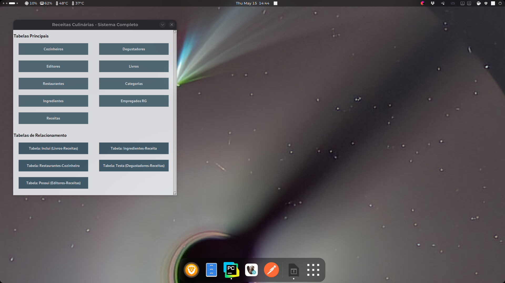
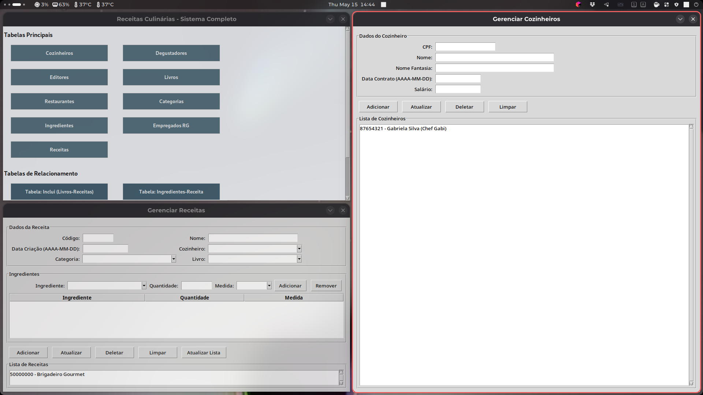
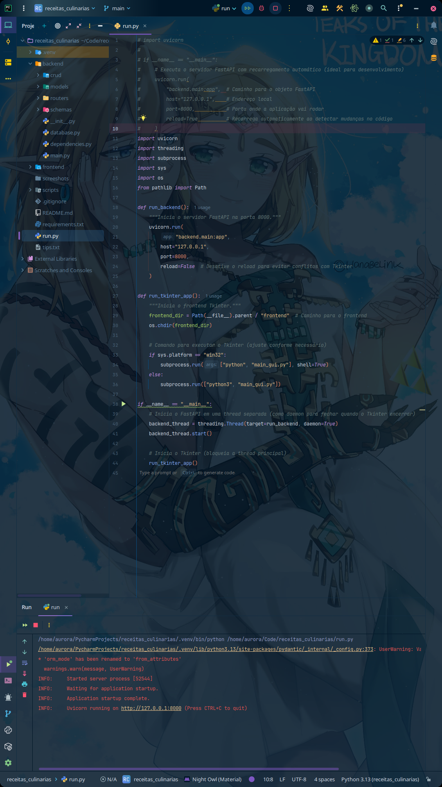

# Sistema de Receitas Culinárias 🍲

Este projeto é um sistema completo para gerenciamento de receitas culinárias, desenvolvido em Python com:

- **Backend**: FastAPI + SQLAlchemy + PostgreSQL
- **Frontend**: Tkinter (GUI)
- **Integração**: A aplicação inicia tanto o backend quanto a interface gráfica com um único comando (`run.py`)

## 🗂️ Estrutura do Projeto

```
.
├── backend
│   ├── crud/
│   ├── models/
│   ├── routers/
│   ├── schemas/
│   └── __init__.py
├── run.py               # Arquivo principal que executa o backend e frontend
├── requirements.txt     # Lista de dependências
└── README.md
```
## 🚀 Como Executar o Projeto
### 1. Clone o repositório
```
git clone https://github.com/seu-usuario/seu-repositorio.git
cd seu-repositorio
```
### 2. Crie um ambiente virtual (opcional, mas recomendado)

``` 
   python -m venv venv
   source venv/bin/activate  # Linux/macOS
   venv\Scripts\activate     # Windows
```
### 3. Instale as dependências
Certifique-se de ter o **PostgreSQL** instalado e em execução.
```
  pip install -r requirements.txt
```
### Se o arquivo ```requirements.txt``` ainda não tiver todas as dependências, certifique-se de incluir:
```
    fastapi
    uvicorn
    sqlalchemy
    psycopg2-binary
    pydantic
    requests
    python-dotenv
```
Obs.: O Tkinter já vem embutido na instalação padrão do Python, mas em algumas distribuições Linux pode ser necessário instalar o pacote python3-tk.

## Fedora:
```
sudo dnf install python3-tkinter
```
## Ubuntu/Debian:
```
sudo apt install python3-tk
```
---
### 4. Configure seu banco de dados PostgreSQL
   Crie o banco e configure as variáveis de ambiente, ou utilize um ```.env``` com:

```env 
   DB_HOST=localhost
   DB_PORT=5432
   DB_NAME=nome_do_banco
   DB_USER=usuario
   DB_PASSWORD=senha
```
Certifique-se de que o ```run.py``` esteja lendo esse arquivo.
---
### 5. Execute o sistema
```
   python run.py
```
Este comando irá:
- Iniciar o backend FastAPI em segundo plano (normalmente em http://127.0.0.1:8000)
- Abrir a interface gráfica Tkinter para interação com as funcionalidades do sistema (CRUD completo)
---
## 🖼️ Prévia do Funcionamento
Abaixo, algumas capturas de tela da aplicação em execução:





---
## ✅ Funcionalidades
- Cadastro, visualização, atualização e exclusão de:
  - Cozinheiros
  - Degustadores
  - Editores
  - Revistas
  - Receitas
  - Ingredientes
  - Relacionamentos como ```RECEITA_INGREDIENTES```, ```RECEITA_DEGUSTADORES```, etc.
---
## 📌 Observações
- O projeto é modular, podendo ser facilmente expandido para incluir novas tabelas ou funcionalidades.

- Os arquivos estão organizados por responsabilidade (models, schemas, routers, etc.).

- Ideal para estudos de integração frontend/backend com Python puro.
---
## 🧠 Tecnologias e Conceitos Utilizados
- FastAPI + Pydantic para criação da API REST
- SQLAlchemy para ORM
- Tkinter para a interface gráfica
- PostgreSQL como banco de dados relacional
- Threads/processos para execução paralela de backend e frontend
- Boas práticas de estrutura modular em Python
---
## 🛠️ Desenvolvedor
Feito com 💙

Sinta-se livre para usar, estudar e melhorar este projeto!
___